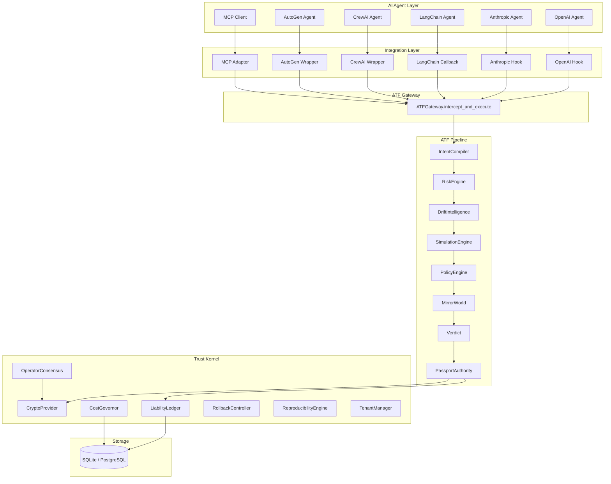
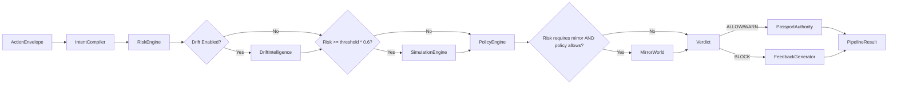
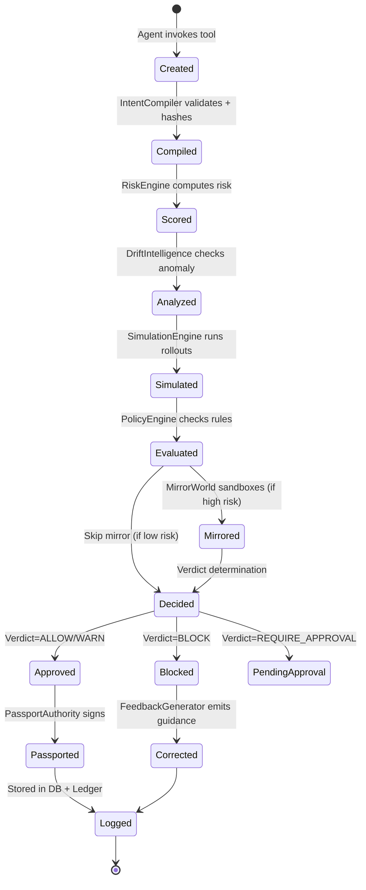
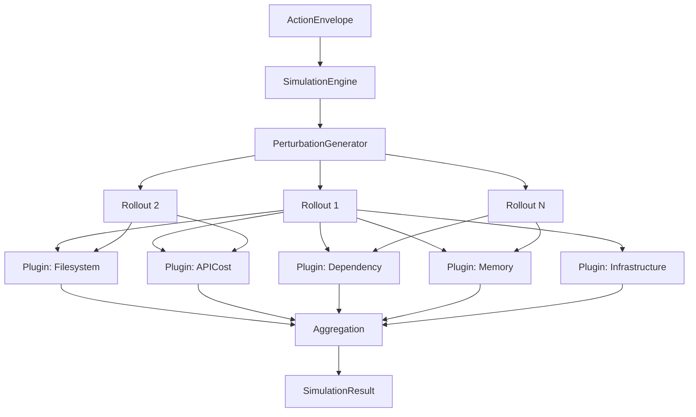
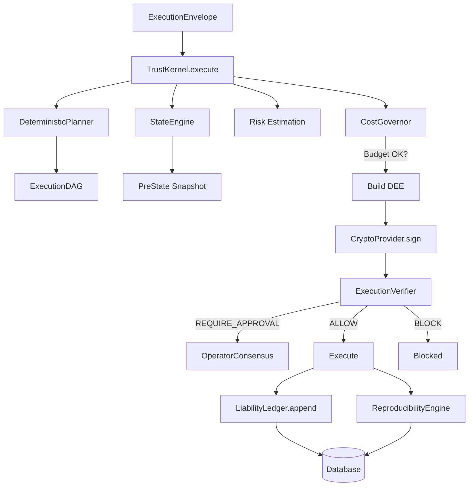
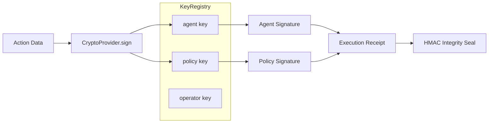
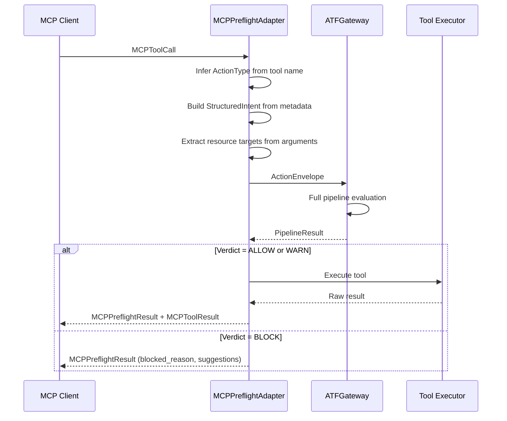

# Preflight Architecture

**Category:** AI Execution Governance
**Tagline:** The control plane between AI intent and real-world execution.

---

## Table of Contents

- [System Overview](#system-overview)
- [High-Level Architecture](#high-level-architecture)
- [Action Transaction Framework (ATF)](#action-transaction-framework-atf)
  - [Pipeline Stages](#pipeline-stages)
  - [ActionEnvelope Lifecycle](#actionenvelope-lifecycle)
  - [IntentCompiler](#1-intentcompiler)
  - [RiskEngine](#2-riskengine)
  - [DriftIntelligence](#3-driftintelligence)
  - [SimulationEngine](#4-simulationengine)
  - [PolicyEngine](#5-policyengine)
  - [MirrorWorld](#6-mirrorworld)
  - [PassportAuthority](#7-passportauthority)
  - [FeedbackGenerator](#8-feedbackgenerator)
- [Trust Kernel (Enterprise Layer)](#trust-kernel-enterprise-layer)
  - [CryptoProvider](#cryptoprovider)
  - [LiabilityLedger](#liabilityledger)
  - [OperatorConsensus](#operatorconsensus)
  - [CostGovernor](#costgovernor)
  - [RollbackController](#rollbackcontroller)
  - [ReproducibilityEngine](#reproducibilityengine)
  - [Multitenancy and RBAC](#multitenancy-and-rbac)
- [MCP Adapter Layer](#mcp-adapter-layer)
- [Framework Integrations](#framework-integrations)
- [Plugin System](#plugin-system)
- [Security Model](#security-model)
  - [Cryptographic Signing](#cryptographic-signing)
  - [Chain Hashing](#chain-hashing)
  - [Passport Verification](#passport-verification)
  - [Tenant Isolation](#tenant-isolation)
- [Data Flow](#data-flow)
- [Deployment Topology](#deployment-topology)
  - [Embedded (Library Mode)](#embedded-library-mode)
  - [Sidecar Service](#sidecar-service)
  - [Centralized Gateway](#centralized-gateway)
  - [Multi-Tenant Cloud (SaaS)](#multi-tenant-cloud-saas)
- [Configuration Reference](#configuration-reference)
- [Observability](#observability)

---

## System Overview

Preflight is an execution governance layer that interposes between AI agent intent and real-world side effects. Every action an AI agent attempts -- file writes, API calls, database mutations, shell commands -- passes through a multi-stage evaluation pipeline before execution is permitted.

The system is designed around two core principles:

1. **No action executes without assessment.** Every tool invocation is wrapped in an `ActionEnvelope`, evaluated through a deterministic pipeline, and either approved (with a signed `ActionPassport`) or blocked (with structured `CorrectionFeedback`).

2. **Every decision is auditable.** Risk scores, policy evaluations, simulation results, and sandbox outcomes are cryptographically signed and recorded in a chain-hashed liability ledger.

Preflight operates at three distinct layers:

| Layer | Package | Purpose |
|---|---|---|
| **ATF Pipeline** | `agent_preflight/atf/` | Core governance pipeline: risk scoring, simulation, policy, sandboxing |
| **Integration Layer** | `agent_preflight/mcp/`, `agent_preflight/integrations/` | Protocol adapters for MCP, OpenAI, Anthropic, LangChain, CrewAI, AutoGen |
| **Trust Kernel** | `trust_kernel/` | Enterprise capabilities: Ed25519 crypto, chain-hashed ledger, M-of-N consensus, cost governance, rollback, reproducibility |

---

## High-Level Architecture

```
                          AI Agent Frameworks
                    (OpenAI / Anthropic / LangChain / CrewAI / AutoGen)
                                    |
                                    v
                    +-------------------------------+
                    |    Integration Adapters        |
                    |  (MCP Adapter / Framework      |
                    |   Hooks / Auto-Instrumentation)|
                    +-------------------------------+
                                    |
                         ActionEnvelope creation
                                    |
                                    v
        +-----------------------------------------------------------+
        |                   ATF Gateway                             |
        |                                                           |
        |   IntentCompiler --> RiskEngine --> DriftIntelligence      |
        |        |                                                  |
        |        +----------> SimulationEngine (Monte Carlo)        |
        |        |                                                  |
        |        +----------> PolicyEngine (YAML rules)             |
        |        |                                                  |
        |        +----------> MirrorWorld (sandbox execution)       |
        |        |                                                  |
        |        +----------> Verdict Determination                 |
        |        |                                                  |
        |        +----------> PassportAuthority (HMAC signing)      |
        |        |                                                  |
        |        +----------> FeedbackGenerator (if blocked)        |
        |                                                           |
        +-----------------------------------------------------------+
                                    |
                             PipelineResult
                                    |
                  +-----------------+-----------------+
                  |                                   |
                  v                                   v
        ActionPassport (if allowed)        CorrectionFeedback (if blocked)
                  |
                  v
        +-----------------------------------------------------------+
        |                   Trust Kernel                             |
        |                                                           |
        |   CryptoProvider (Ed25519 / HMAC-SHA256)                  |
        |   LiabilityLedger (chain-hashed, append-only)             |
        |   OperatorConsensus (M-of-N approval)                     |
        |   CostGovernor (budget + rate limiting)                   |
        |   RollbackController (file / DB / API compensations)      |
        |   ReproducibilityEngine (deterministic replay manifests)  |
        |   TenantManager + RBAC                                    |
        |                                                           |
        +-----------------------------------------------------------+
```



---

## Action Transaction Framework (ATF)

The ATF is the core governance pipeline. It lives in `agent_preflight/atf/` and is orchestrated by the `ATFGateway` class.

### Pipeline Stages

Every action traverses the following stages in order. Stages are conditionally executed based on risk thresholds and configuration.



| Stage | Module | Latency Target | Condition |
|---|---|---|---|
| Intent Compilation | `intent_compiler.py` | <5ms | Always |
| Risk Scoring | `risk_engine.py` | <20ms | Always |
| Drift Analysis | `drift.py` | <50ms | `drift_enabled=True` |
| Monte Carlo Simulation | `simulation.py` | <200ms | Risk >= `risk_threshold_mirror * 0.6` |
| Policy Evaluation | `policy_v2.py` | <10ms | Always |
| Mirror World Sandbox | `mirror_world.py` | <5000ms | `risk.requires_mirror AND policy.allow` |
| Passport Issuance | `passport.py` | <5ms | Verdict is ALLOW or WARN |
| Feedback Generation | `feedback.py` | <5ms | Verdict is BLOCK |

Total pipeline target: <800ms for the common path (no mirror execution).

### ActionEnvelope Lifecycle

The `ActionEnvelope` is the universal input to the ATF pipeline. Every tool invocation, regardless of source framework, is normalized into this structure before evaluation.



**ActionEnvelope fields:**

| Field | Type | Description |
|---|---|---|
| `action_id` | `UUID` | Unique identifier for this action |
| `timestamp` | `datetime` | UTC creation time |
| `agent_id` | `str` | Identifier of the originating agent |
| `tool_name` | `str` | Tool being invoked |
| `action_type` | `ActionType` | READ, WRITE, DELETE, EXECUTE, NETWORK, SHELL, FILESYSTEM, API_CALL |
| `arguments` | `dict` | Tool arguments |
| `intent` | `StructuredIntent` | Declared goal, reasoning, expected state changes, cost, confidence |
| `resource_targets` | `list[str]` | Paths, URLs, or identifiers being acted upon |
| `privilege_level` | `str` | Requested privilege level |
| `metadata` | `dict` | Arbitrary metadata (MCP request ID, session info, etc.) |

**PipelineResult fields:**

| Field | Type | Description |
|---|---|---|
| `action_id` | `str` | Correlates to the input ActionEnvelope |
| `verdict` | `Verdict` | ALLOW, WARN, BLOCK, or REQUIRE_APPROVAL |
| `risk_assessment` | `RiskAssessment` | Score, flags, breakdown |
| `simulation_result` | `SimulationResult?` | Monte Carlo failure/cascade probabilities |
| `drift_insight` | `DriftInsight?` | Anomaly score, historical failure rate |
| `mirror_result` | `MirrorResult?` | Sandbox state deltas, permission violations |
| `policy_decision` | `PolicyDecision` | Rule evaluations, violations |
| `passport` | `ActionPassport?` | HMAC-signed audit artifact (if approved) |
| `correction` | `CorrectionFeedback?` | Structured remediation guidance (if blocked) |
| `human_summary` | `str` | Natural language summary of the decision |
| `total_pipeline_time_ms` | `float` | End-to-end pipeline latency |

---

### 1. IntentCompiler

**Module:** `agent_preflight/atf/intent_compiler.py`

Validates, normalizes, and fingerprints the `StructuredIntent` attached to every `ActionEnvelope`.

**Responsibilities:**
- Validate all required intent fields (goal, reasoning_summary)
- Generate a 64-dimensional pseudo-embedding via locality-sensitive hashing (default) or a pluggable `EmbeddingProvider`
- Compute a SHA-256 `intent_hash` over the canonical JSON of the intent
- Return a `CompiledIntent` containing the embedding, hash, and metadata

**Embedding provider interface:**
```python
class EmbeddingProvider(Protocol):
    async def embed(self, text: str) -> list[float]: ...
```

The default `HashEmbedding` uses feature hashing with positional decay and L2 normalization. It requires no external API calls and runs in <1ms. Production deployments can substitute a real embedding model (e.g., OpenAI `text-embedding-3-small`) by passing a custom provider.

---

### 2. RiskEngine

**Module:** `agent_preflight/atf/risk_engine.py`

Fast, deterministic risk scoring using weighted feature extraction and logistic regression. No LLM calls. Target latency: <20ms.

**Scoring model:**

```
score = sigmoid(sum(feature_i * weight_i) + bias)
```

**Feature set:**

| Feature | Weight | Trigger |
|---|---|---|
| `irreversible` | 3.0 | Intent declares `irreversible=True` |
| `destructive_tool` | 2.5 | Tool name matches destructive patterns (delete, drop, rm, etc.) |
| `financial_tool` | 2.8 | Tool name matches financial patterns (pay, transfer, charge, etc.) |
| `shell_tool` | 2.2 | Tool name matches shell patterns (exec, bash, system, etc.) |
| `network_tool` | 1.5 | Tool name matches network patterns (send, email, webhook, etc.) |
| `sensitive_path` | 2.0 | Arguments reference sensitive paths (/etc/, .env, .ssh, prod, etc.) |
| `high_cost` | 1.8 | `estimated_cost > $10` |
| `low_confidence` | 1.5 | `confidence < 0.5` |
| `wide_scope` | 1.2 | More than 5 expected state changes |
| `drift_similarity` | 2.0 | Drift similarity to known failures > 0.3 |
| `external_calls` | 1.3 | Declared external calls > 0 |
| `multiple_state_changes` | 1.0 | More than 2 state changes |

**Bias:** -2.0 (shifts sigmoid so routine actions score low)

**Outputs:**
- `score`: float in [0.0, 1.0]
- `flags`: list of triggered feature names
- `requires_mirror`: True if score >= `mirror_threshold`
- `breakdown`: per-feature contribution to the score
- `computation_time_ms`: actual wall-clock time

Weights can be hot-updated at runtime via `update_weights()` without restart.

---

### 3. DriftIntelligence

**Module:** `agent_preflight/atf/drift.py`

Behavioral anomaly detection using lightweight ML. Detects when an agent's actions deviate from established patterns or resemble known failure signatures.

**Components:**
- **IsolationScorer:** Isolation-forest-inspired anomaly detector. Computes how "isolated" an action's embedding is from the historical distribution by measuring average cosine distance to random subsets (10 estimators, 20 samples each).
- **Failure signature registry:** Known-bad patterns stored as embeddings. New actions are compared via cosine similarity; matches above 0.6 are flagged.
- **Historical failure rate:** Proportion of past similar actions (cosine similarity > 0.5) that resulted in a BLOCK verdict.

**Outputs (`DriftInsight`):**
- `similarity_score`: Maximum cosine similarity to registered failure signatures
- `historical_failure_rate`: Failure rate among similar past actions
- `anomaly_score`: Isolation-based anomaly score in [0.0, 1.0]
- `is_anomalous`: True if `anomaly_score >= threshold` (default 0.7)
- `similar_actions`: Names of matched failure signatures

---

### 4. SimulationEngine

**Module:** `agent_preflight/atf/simulation.py`

Monte Carlo consequence modeling. Runs N lightweight rollouts with randomized perturbation vectors to estimate failure probability, cascade risk, and resource volatility.

**Architecture:**



**Perturbation vector dimensions:**
- `timing_variance`: Gaussian(1.0, 0.3)
- `resource_pressure`: Uniform(0.0, 1.0)
- `network_latency_ms`: Gaussian(50, 100), clamped >= 0
- `memory_pressure`: Uniform(0.0, 1.0)
- `api_rate_limit_proximity`: Uniform(0.0, 1.0)
- `external_failure_prob`: Uniform(0.0, 0.3)
- `concurrent_load`: Uniform(0.0, 1.0)

**Default configuration:** 50 rollouts, 10 concurrent. Enterprise mode: 200 rollouts.

**Statistical output:**
- `failure_probability`: Proportion of rollouts that detected failure
- `cascade_probability`: Proportion with cascading failures
- `resource_spike_probability`: Proportion with resource impact > 0.7
- `volatility_score`: Maximum standard deviation of failure rates across plugins
- `confidence_interval`: Wilson score interval (z=1.96) for failure probability

---

### 5. PolicyEngine

**Module:** `agent_preflight/atf/policy_v2.py`

YAML-based compliance-as-code. Declarative policy rules are evaluated against every `ActionEnvelope` in real time.

**Rule format (YAML):**
```yaml
rules:
  - name: block-production-writes
    condition: 'path startswith "/prod" AND tool matches "write|update|delete"'
    action: block
    severity: critical

  - name: require-approval-expensive
    condition: 'estimated_cost > 500'
    action: require_approval
    severity: high

  - name: no-off-hours-deploys
    condition: 'time outside 9-18 AND tool matches "deploy"'
    action: block
    severity: medium
```

**Supported condition operators:**
- `path startswith "<prefix>"` -- checks resource_targets and string arguments
- `tool == "<name>"` / `tool matches "<regex>"` -- exact or regex match on tool_name
- `estimated_cost > <N>` -- checks intent.estimated_cost
- `irreversible == true` -- checks intent.irreversible
- `time outside <H>-<H>` -- UTC hour range
- `agent_id == "<id>"` -- checks envelope.agent_id
- `args_match "<pattern>"` -- regex over serialized arguments
- `confidence < <N>` -- checks intent.confidence
- `AND` / `OR` combinators

**Actions:** `block`, `require_approval`, `warn`

---

### 6. MirrorWorld

**Module:** `agent_preflight/atf/mirror_world.py`

Deterministic sandbox for high-risk actions. Creates an isolated temporary filesystem, stubs network calls, executes the tool, captures state deltas, and validates results against declared intent.

**Execution flow:**
1. Extract file/directory paths from `ActionEnvelope` arguments and resource_targets
2. Clone affected paths into a temporary directory (`atf_mirror_` prefix)
3. Snapshot all file hashes (SHA-256) before execution
4. Stub network calls via `NetworkStub` (captures GET/POST/PUT/DELETE attempts)
5. Enforce `PermissionMatrix` (allow_read, allow_write, allow_delete)
6. Rewrite path arguments to point into the mirror directory
7. Execute the tool function within the sandbox
8. Snapshot file hashes after execution
9. Compute `FileDelta` list (created, modified, deleted files with before/after hashes)
10. Validate against declared intent:
    - Unexpected deletions when `irreversible=False` are flagged
    - Undeclared external calls are flagged
    - Scope violations (3x more changes than declared) are flagged

**Outputs (`MirrorResult`):**
- `state_delta`: List of file changes with hashes
- `external_attempts`: Captured network call attempts
- `permission_violations`: Denied operations
- `exceptions`: Runtime errors during sandbox execution
- `matches_intent`: Boolean -- does the sandbox outcome match the declared intent?
- `mismatch_details`: Specific discrepancies

---

### 7. PassportAuthority

**Module:** `agent_preflight/atf/passport.py`

Issues HMAC-SHA256-signed `ActionPassport` artifacts for every approved action.

**Passport fields:**
- `passport_id`: UUID
- `action_id`, `agent_id`, `tool_name`: Action provenance
- `intent_hash`: SHA-256 of the canonical intent JSON
- `risk_score`, `simulation_risk`, `drift_score`: Quantified risk
- `policy_status`: "approved" or "denied"
- `mirror_executed`, `mirror_matched`: Sandbox outcome
- `verdict`: ALLOW, WARN, BLOCK, or REQUIRE_APPROVAL
- `signature`: HMAC-SHA256 over canonical passport fields
- `timestamp`: UTC

**Signing:**
```python
canonical = json.dumps({
    "passport_id", "action_id", "agent_id", "intent_hash",
    "risk_score", "policy_status", "timestamp"
}, sort_keys=True)
signature = HMAC-SHA256(secret_key, canonical)
```

Passports are independently verifiable by any party with the signing key. They are stored in the ATF database and can be forwarded to the Trust Kernel ledger.

---

### 8. FeedbackGenerator

**Module:** `agent_preflight/atf/feedback.py`

When an action is blocked, the FeedbackGenerator produces structured `CorrectionFeedback` that agents can use to revise their plans without human intervention.

**Output fields:**
- `declared_goal`: What the agent said it wanted to do
- `actual_result`: What actually happened (or would have happened)
- `violations`: Specific policy/risk/mirror violations
- `suggestions`: Actionable remediation suggestions
- `rewrite_hints`: Specific parameter or approach changes
- `blocked`: True

---

## Trust Kernel (Enterprise Layer)

The Trust Kernel (`trust_kernel/`) provides enterprise-grade capabilities that sit beneath or alongside the ATF pipeline. It is orchestrated by the `TrustKernel` class in `trust_kernel/kernel.py`.



### CryptoProvider

**Module:** `trust_kernel/crypto.py`

Unified cryptographic operations with two backends:
- **Ed25519** (via `cryptography` library): 128-bit security, deterministic signatures, ~60,000 ops/sec
- **HMAC-SHA256** (zero-dependency fallback): Same interface, reduced security properties

**Capabilities:**
- **Key pair management:** Generation, rotation, revocation via `KeyRegistry`
- **Role-scoped keys:** Separate key pairs for `agent`, `policy`, and `operator` roles
- **SHA-256 state hashing:** Canonical JSON serialization with deterministic key ordering
- **HMAC envelope integrity:** Per-message integrity verification
- **Execution receipts:** Multi-signature receipts with agent + policy signatures and HMAC integrity seal
- **Public key export:** Distribute public key material for independent verification



---

### LiabilityLedger

**Module:** `trust_kernel/ledger.py`

Append-only, tamper-evident record of every action. Each `LiabilityRecord` is chain-linked to the previous record via cryptographic hashing, creating an auditable chain of custody.

**Chain hashing scheme:**
```
record[0].chain_hash = SHA-256(record[0].canonical || "genesis")
record[n].chain_hash = SHA-256(record[n].canonical || record[n-1].chain_hash)
```

**Schema (SQLite):**
```sql
CREATE TABLE liability_ledger (
    record_id       TEXT PRIMARY KEY,
    action_id       TEXT NOT NULL,
    dee_id          TEXT NOT NULL,
    agent_id        TEXT NOT NULL,
    operator_id     TEXT,
    tool_name       TEXT NOT NULL,
    risk_score      REAL NOT NULL,
    verdict         TEXT NOT NULL,
    pre_state_hash  TEXT,
    post_state_hash TEXT,
    agent_signature     TEXT,
    operator_signature  TEXT,
    policy_signature    TEXT,
    chain_hash      TEXT NOT NULL,
    metadata        TEXT,
    timestamp       TEXT NOT NULL,
    created_at      TEXT NOT NULL DEFAULT (datetime('now'))
);
```

**Indexed columns:** `agent_id`, `timestamp`, `verdict`, `risk_score`, `chain_hash`

**Integrity verification:**
```python
is_valid, verified_count = await ledger.verify_chain_integrity()
```

Walks the entire chain from genesis, recomputing each chain hash and comparing. Returns `(False, N)` at the first tampered record.

**Export formats:** JSON, CSV -- suitable for external auditors and compliance tooling.

---

### OperatorConsensus

**Module:** `trust_kernel/consensus.py`

Configurable M-of-N approval for high-risk or irreversible actions.

**Flow:**
1. Pipeline determines `REQUIRE_APPROVAL` verdict
2. `ConsensusRequest` is created with expiry (default: 30 minutes)
3. Operators cast signed votes (approve/reject with reason)
4. Any rejection immediately blocks the action
5. Action proceeds once M approvals are collected
6. Expired requests are auto-rejected

Each vote is cryptographically signed using the operator's key via `CryptoProvider`. Vote deduplication prevents double-voting.

---

### CostGovernor

**Module:** `trust_kernel/cost_governor.py`

Enforces hard limits on AI agent resource consumption to prevent runaway costs and infinite loops.

**Tracked dimensions:**

| Dimension | Default Limit | Description |
|---|---|---|
| Financial cost (USD) | Configurable | Cumulative spend tracking |
| Token consumption | Configurable | LLM token budget |
| API call count | Configurable | Total API invocations |
| Recursion depth | Configurable | Per-tool recursion depth |
| Tool invocation count | Configurable | Total tool invocations |

**Alert types:** `warning` (>80% of limit), `exceeded`, `blocked`

Each dimension is checked before execution. Budget is charged after successful execution only.

---

### RollbackController

**Module:** `trust_kernel/rollback.py`

Manages atomic rollback for actions with side effects.

**Supported rollback types:**
- **File restore:** Copy pre-state file snapshots back to original locations
- **Database transaction:** Execute compensating SQL queries
- **API compensating actions:** Invoke registered callback functions

Rollback plans are executed in reverse order. Partial rollback is supported -- coverage is computed as the proportion of successfully rolled-back entries.

---

### ReproducibilityEngine

**Module:** `trust_kernel/reproducibility.py`

Enables deterministic replay of any action for incident investigation and compliance audits.

**Replay manifest captures:**
- Model version and seed
- Temperature setting
- Complete pre-state snapshot
- Full execution envelope (agent_id, tool_name, arguments, intent)
- Expected result for validation

**Replay validation** compares actual results against the manifest, computing field-level fidelity scores and listing specific mismatches.

---

### Multitenancy and RBAC

**Module:** `trust_kernel/multitenancy.py`

Full multi-tenant isolation with hierarchical organizations.

**Tenant structure:**
- Organizations contain teams (via `parent_id` hierarchy)
- Each tenant gets: isolated ledger namespace, separate policy configuration, dedicated budget, scoped API tokens, per-tier rate limits
- Tiers: `free` (100 RPM, $100 budget), `pro` (1,000 RPM, $10,000 budget), `enterprise` (10,000 RPM, $1,000,000 budget)

**API token scoping:**
- Tokens are SHA-256 hashed before storage (plaintext never persisted)
- Scopes: `read`, `execute`, `admin`
- Expiration and revocation support

**RBAC roles:**

| Role | Permissions |
|---|---|
| `admin` | execute, approve, reject, query/export ledger, manage policies/keys/tenants/tokens/budgets, view dashboard/stats, verify ledger |
| `operator` | execute, approve, reject, query ledger, view dashboard/stats, verify ledger |
| `auditor` | query/export ledger, view dashboard/stats, verify ledger |
| `viewer` | view dashboard/stats |

---

## MCP Adapter Layer

**Module:** `agent_preflight/mcp/`

The MCP (Model Context Protocol) adapter is the primary integration point for AI agents using the MCP standard.

**Components:**
- `models.py`: `MCPToolCall`, `MCPToolResult`, `MCPPreflightResult` -- Pydantic models for MCP data
- `adapter.py`: `MCPPreflightAdapter` -- converts MCP tool calls to ATF `ActionEnvelope` objects
- `middleware.py`: ASGI/protocol-level middleware for transparent interception

**Conversion flow:**



**ActionType inference** uses regex pattern matching against the tool name:
- Destructive patterns (delete, remove, drop) -> `DELETE`
- Write patterns (create, update, save) -> `WRITE`
- Read patterns (get, fetch, list) -> `READ`
- Network patterns (http, send, webhook) -> `NETWORK`
- Shell patterns (exec, bash, command) -> `SHELL`
- Filesystem patterns (file, directory, mkdir) -> `FILESYSTEM`
- API patterns (api, rpc, graphql) -> `API_CALL`
- Fallback: `EXECUTE`

---

## Framework Integrations

**Module:** `agent_preflight/integrations/`

| Framework | Module | Integration Method |
|---|---|---|
| OpenAI | `integrations/` | Function calling capture |
| Anthropic | `anthropic_hook.py` | `tool_use` block interception |
| LangChain | `langchain.py` | `PreflightCallbackHandler` for tool call callbacks |
| CrewAI | `crewai_hook.py` | Auto-wrap tool call decorators |
| AutoGen | `integrations/` | Function map wrapping |

Each integration converts framework-specific tool call formats into `ActionEnvelope` objects, runs them through the ATF pipeline, and returns framework-appropriate responses.

---

## Plugin System

The simulation engine uses a plugin architecture for domain-specific risk modeling. Plugins implement the `SimulationPlugin` abstract base class.

**Plugin interface:**

```python
class SimulationPlugin(ABC):
    @property
    @abstractmethod
    def name(self) -> str: ...

    @abstractmethod
    def supports(self, envelope: ActionEnvelope) -> bool: ...

    @abstractmethod
    async def simulate(
        self,
        envelope: ActionEnvelope,
        perturbation: dict[str, float],
    ) -> DomainSimulationResult: ...
```

**Built-in plugins:**

| Plugin | Module | Domain |
|---|---|---|
| `FilesystemCascadePlugin` | `plugins/filesystem.py` | Cascading filesystem failures (recursive deletes, permission errors) |
| `APICostExplosionPlugin` | `plugins/api_cost.py` | API cost amplification under retry/rate-limit pressure |
| `DependencyGraphPlugin` | `plugins/dependency.py` | Downstream dependency failures from mutations |
| `MemoryRunawayPlugin` | `plugins/memory.py` | Memory exhaustion from unbounded operations |
| `InfrastructureMutationPlugin` | `plugins/infrastructure.py` | Infrastructure state drift from config mutations |

**Registration:**
```python
gateway = ATFGateway(config)
gateway.register_plugins([
    FilesystemCascadePlugin(),
    APICostExplosionPlugin(),
    MyCustomPlugin(),  # Third-party plugins
])
```

Plugins are independently installable. The `supports()` method controls which actions a plugin evaluates -- plugins that do not support a given action are skipped.

---

## Security Model

### Cryptographic Signing

Preflight uses a layered cryptographic model:

**Layer 1 -- ATF Passports (HMAC-SHA256):**
Every approved action receives an `ActionPassport` signed with HMAC-SHA256 using a configurable secret key. Passports cover: `passport_id`, `action_id`, `agent_id`, `intent_hash`, `risk_score`, `policy_status`, `timestamp`.

**Layer 2 -- Trust Kernel Receipts (Ed25519 / HMAC-SHA256):**
The Trust Kernel uses Ed25519 asymmetric signatures (with HMAC-SHA256 fallback when the `cryptography` library is not installed). Execution receipts carry:
- Agent signature (signs the DEE canonical bytes)
- Policy signature (signs the DEE canonical bytes)
- HMAC integrity seal over the entire receipt

**Key management:**
- `KeyRegistry` manages key lifecycle: generation, rotation, revocation
- Role-scoped keys (agent, policy, operator) prevent cross-role signature reuse
- Public keys are exportable for independent verification by external auditors
- Key rotation creates a new key pair and revokes the old one atomically

### Chain Hashing

The `LiabilityLedger` implements a blockchain-inspired chain hash:

```
H(0) = SHA-256(record_0_canonical || "genesis")
H(n) = SHA-256(record_n_canonical || H(n-1))
```

This provides:
- **Tamper evidence:** Modifying any record breaks all subsequent chain hashes
- **Ordering guarantee:** Records are cryptographically ordered
- **Independent verification:** Any auditor can verify the entire chain with `verify_chain_integrity()`

### Passport Verification

```python
# Issuing
passport = authority.issue(envelope, intent_hash, risk, policy, verdict, ...)
# passport.signature is set automatically

# Verification (by any party with the key)
is_valid = authority.verify(passport)
```

Verification recomputes the HMAC over canonical fields and uses constant-time comparison (`hmac.compare_digest`) to prevent timing attacks.

### Tenant Isolation

- API keys are SHA-256 hashed before storage
- Scoped tokens support granular permissions (read, execute, admin)
- Rate limits are enforced per tenant per tier
- RBAC bindings are tenant-scoped -- no cross-tenant permission leakage
- Budget limits are per-tenant with configurable ceilings

---

## Data Flow

Complete data flow for a single tool invocation:

```
1. Agent invokes tool (e.g., via MCP, LangChain, or direct API call)
                    |
2. Integration layer converts to ActionEnvelope
                    |
3. ATFGateway.intercept_and_execute(envelope)
    |
    +-- 3a. IntentCompiler.compile(envelope)
    |       -> CompiledIntent {embedding, intent_hash}
    |
    +-- 3b. DriftIntelligenceEngine.analyze(fingerprint, embedding)
    |       -> DriftInsight {similarity_score, anomaly_score}
    |
    +-- 3c. RiskEngine.assess(envelope, drift_similarity)
    |       -> RiskAssessment {score, flags, requires_mirror, breakdown}
    |
    +-- 3d. SimulationEngine.run_rollouts(envelope, n=50)  [conditional]
    |       -> SimulationResult {failure_prob, cascade_prob, volatility}
    |
    +-- 3e. YAMLPolicyEngine.evaluate(envelope)
    |       -> PolicyDecision {allow, requires_approval, violations}
    |
    +-- 3f. MirrorWorld.execute(envelope, tool_fn)  [conditional]
    |       -> MirrorResult {state_delta, matches_intent}
    |
    +-- 3g. _determine_verdict(risk, policy, mirror, simulation)
    |       -> Verdict {ALLOW | WARN | BLOCK | REQUIRE_APPROVAL}
    |
    +-- 3h. FeedbackGenerator.generate(...)  [if BLOCK]
    |       -> CorrectionFeedback {violations, suggestions, rewrite_hints}
    |
    +-- 3i. PassportAuthority.issue(...)  [if ALLOW or WARN]
    |       -> ActionPassport {signed, tamper-proof audit record}
    |
    +-- 3j. ATFDatabase: store passport, risk, pipeline log, drift embedding
    |
    +-- 3k. Return PipelineResult to caller
                    |
4. Integration layer converts PipelineResult to framework-specific response
                    |
5. Agent receives verdict + risk metadata + passport (or correction feedback)
```

**Verdict determination logic:**

| Priority | Condition | Verdict |
|---|---|---|
| 1 | Policy blocks (`policy.allow == False`) | BLOCK |
| 2 | Policy requires approval | REQUIRE_APPROVAL |
| 3 | Mirror mismatch (`mirror.matches_intent == False`) | BLOCK |
| 4 | Critical risk (`risk.score >= risk_threshold_block`) | BLOCK |
| 5 | High simulation failure (`failure_probability > 0.6`) | BLOCK |
| 6 | Moderate risk (`risk.score >= risk_threshold_mirror`) | WARN |
| 7 | Moderate simulation risk (`failure_probability > 0.3`) | WARN |
| 8 | Default | ALLOW |

---

## Deployment Topology

### Embedded (Library Mode)

Direct import into the agent process. Lowest latency. Suitable for development and single-agent deployments.

```
+-------------------------------------------+
|              Agent Process                |
|                                           |
|  Agent Code  -->  ATFGateway  -->  Tool   |
|                      |                    |
|              SQLite (local file)          |
+-------------------------------------------+
```

```python
from agent_preflight.atf.gateway import ATFGateway

gateway = ATFGateway(config)
await gateway.initialize()
result = await gateway.intercept_and_execute(envelope)
```

### Sidecar Service

ATF runs as a FastAPI sidecar alongside the agent. Communication via localhost HTTP.

```
+------------------+    HTTP/localhost    +------------------+
|   Agent Process  | -----------------> |  Preflight Sidecar |
|                  | <----------------- |  (FastAPI :8000)   |
+------------------+                    +------------------+
                                              |
                                        SQLite / PostgreSQL
```

```bash
uvicorn agent_preflight.atf.gateway:create_fastapi_app \
    --host 0.0.0.0 --port 8000 --factory
```

**Endpoints:**
- `POST /execute` -- Submit an action for evaluation
- `GET /passports` -- Query action passports (filterable by agent_id, min_risk)
- `GET /stats` -- Pipeline statistics
- `GET /health` -- Health check

### Centralized Gateway

Shared Preflight instance serving multiple agents. Deployed as a container with Prometheus + Grafana observability.

```
+-----------+  +-----------+  +-----------+
| Agent A   |  | Agent B   |  | Agent C   |
+-----------+  +-----------+  +-----------+
      \              |              /
       \             |             /
        v            v            v
   +-----------------------------------+
   |        Preflight Gateway          |
   |        (FastAPI + Uvicorn)        |
   +-----------------------------------+
              |            |
   +----------+    +-------+--------+
   | PostgreSQL|   | Prometheus     |
   |           |   | + Grafana      |
   +-----------+   +----------------+
```

Docker Compose deployment:
```yaml
services:
  preflight:
    build: .
    ports: ["8000:8000"]
    volumes: [preflight-data:/app/data]
    healthcheck:
      test: ["CMD", "curl", "-f", "http://localhost:8000/health"]

  prometheus:
    image: prom/prometheus:latest
    ports: ["9090:9090"]

  grafana:
    image: grafana/grafana:latest
    ports: ["3000:3000"]
```

### Multi-Tenant Cloud (SaaS)

Full multi-tenant deployment with per-organization isolation, RBAC, and billing.

```
+------------------+  +------------------+  +------------------+
| Tenant: Acme Corp|  | Tenant: Globex   |  | Tenant: Initech  |
| (Enterprise)     |  | (Pro)            |  | (Starter)        |
+------------------+  +------------------+  +------------------+
         \                    |                    /
          v                   v                   v
+--------------------------------------------------------+
|                 Preflight Cloud Gateway                |
|                                                        |
|  TenantManager --> RBAC --> Rate Limiter --> Router    |
+--------------------------------------------------------+
            |                    |                    |
  +---------+------+  +---------+------+  +----------+-----+
  | Acme Namespace |  | Globex Namespace|  | Initech NS    |
  | - Ledger       |  | - Ledger       |  | - Ledger       |
  | - Policies     |  | - Policies     |  | - Policies     |
  | - Keys         |  | - Keys         |  | - Keys         |
  | - Budget       |  | - Budget       |  | - Budget       |
  +-----------------+  +-----------------+  +----------------+
```

**Cloud models** (`cloud/models/tenant.py`) define:
- `Tenant`: Organization with plan (starter/professional/enterprise), settings, slug
- `TenantSettings`: Per-tenant risk thresholds, rate limits, budget caps, execution mode
- `TenantUser`: Users with roles (owner/operator/auditor)
- `APIKey`: Scoped API keys with rate limits and expiration

---

## Configuration Reference

The ATF pipeline is configured via `ATFConfig` (`agent_preflight/atf/config.py`). Preset modes provide tuned defaults.

| Parameter | Safe | Balanced | Aggressive | Enterprise |
|---|---|---|---|---|
| `risk_threshold_mirror` | 0.3 | 0.5 | 0.7 | 0.3 |
| `risk_threshold_block` | 0.6 | 0.8 | 0.9 | 0.5 |
| `simulation_rollouts` | 100 | 50 | 20 | 200 |
| `mirror_enabled` | True | True | False | True |
| `drift_enabled` | True | True | True | True |
| `structured_logging` | True | True | True | True |
| `max_pipeline_time_ms` | 800 | 800 | 800 | 800 |

**Environment variables:**
- `ATF_PASSPORT_SECRET`: HMAC signing key for passports
- `PREFLIGHT_HMAC_KEY`: HMAC key for Trust Kernel integrity
- `PREFLIGHT_LOG_LEVEL`: Logging verbosity

---

## Observability

Preflight provides built-in observability at multiple levels.

**Pipeline metrics (per action):**
- `total_pipeline_time_ms`: End-to-end latency
- `risk_assessment.computation_time_ms`: Risk scoring latency
- `simulation_result.total_time_ms`: Simulation latency
- `mirror_result.execution_time_ms`: Sandbox latency

**Aggregate metrics (via `/stats` endpoint):**
- Total actions evaluated
- Verdict distribution (allow/warn/block/require_approval)
- Average risk score
- Pipeline throughput

**Audit trail:**
- Every action is logged to the ATF database with full pipeline results
- The Trust Kernel liability ledger provides chain-hashed, tamper-evident audit records
- Passports are independently verifiable
- Replay manifests enable deterministic incident replay

**Infrastructure monitoring:**
- Docker health checks on `/health`
- Prometheus metrics endpoint
- Grafana dashboards (via `docker-compose.yml`)

---

*Preflight is the execution governance layer for AI agents. It does not replace human judgment -- it ensures that every AI action is assessed, recorded, and auditable before it touches the real world.*
